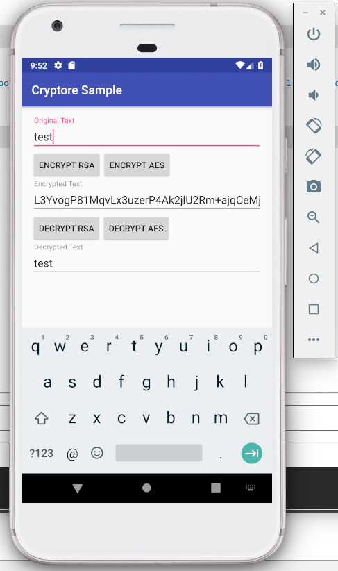

Based on  

Cryptore
====

More info
====

Information at rest secure storage:

Android:
- Store in cleartext

- Store encrypted using a symmetric key

- Using the Android Keystore (symmetric, asymmetric based on version)*

- Store encrypted using asymmetric keys (SMSPKI)**

* hackable on Rooted device, however gets harder with newer Androids

** very secure (accepting the SMS spoof risk), but also complex to integrate and setup. As a disadv. SMS costs also money.

iOS:
- Store in cleartext
- Store encrypted using a symmetric key
- Using the KeyChain (assume it’s asymmetric)
- Store encrypted using asymmetric keys (SMSPKI)

IMHO Balance between implementation complexity and security

Android:
- KeyStore

iOS:
- Keychain

The Android Keystore provides access to special secure hardware for storing cryptographic keys.
The Android Keystore was significantly enhanced in Android 6.0 (API level 23) to provide more capabilities on those devices with the hardware to support them. On devices with the appropriate hardware support, keys can be generated within the secure hardware, and then used to perform cryptographic operations on user data, without the keys ever leaving the secure hardware. It is simply not possible to extract (at least through software means) the keys stored in the secure hardware.

If the device the app is running on has hardware-backed secure storage, then
Key material may be bound to the secure hardware (e.g., Trusted Execution Environment (TEE), Secure Element (SE)) of the Android device. When this feature is enabled for a key, its key material is never exposed outside of secure hardware.
If the device does not have hardware-backed (OLD Androids) secure storage, then:
Key material never enters the application process. When an application performs cryptographic operations using an Android Keystore key, behind the scenes plaintext, ciphertext, and messages to be signed or verified are fed to a system process which carries out the cryptographic operations.

